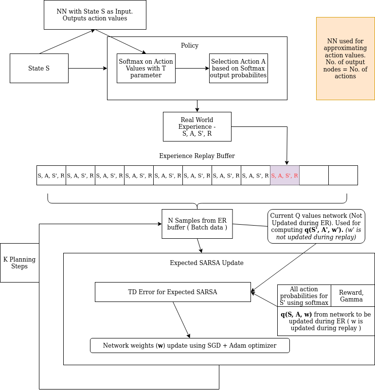
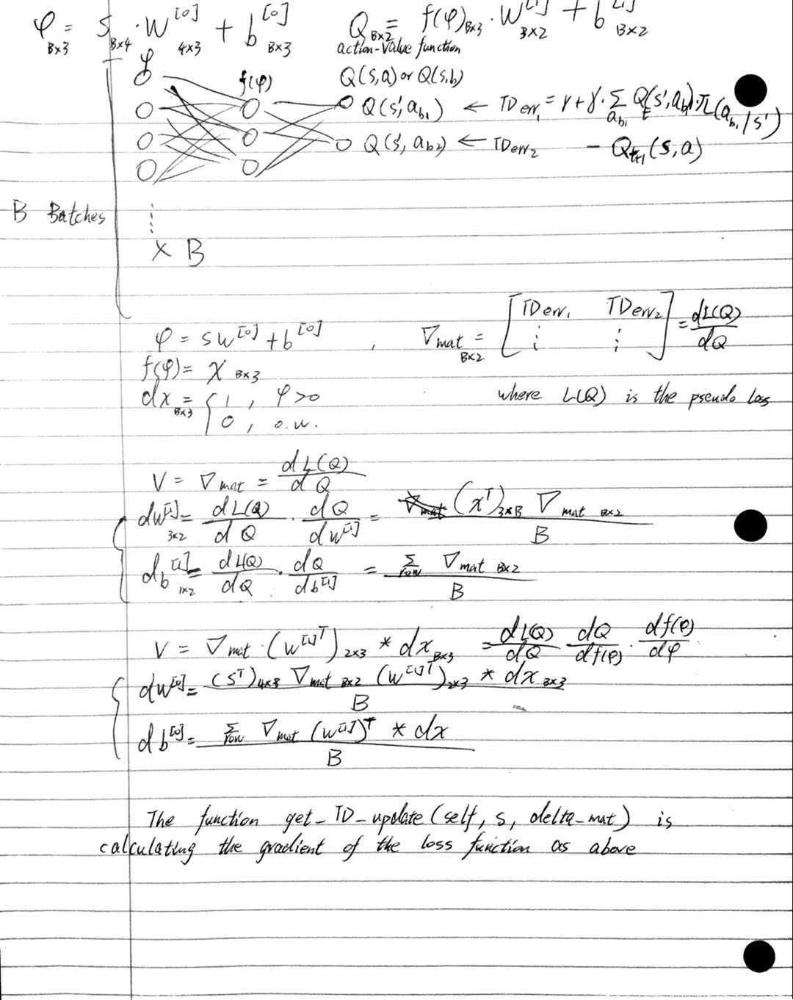

# A-lunar-landing-simulator
### A simulated lunar landing agent using Expected Sarsa with Neural Network and Experience Replay

This is a final course project that I did in Reinforcement Learning Specialization offered by the University of Alberta and Coursera.

Training result of the landing simulator:

And I appreciate the help from Mr. Ganesh for creating this nice looking workflow plot.

There are two NN for action-value, Q, approximation: 

1. One NN uses the current s and action to generate a set of action values for the next sate, s', and next action, a'.
2. A second NN iteratively uses the sampled data from the buffer of Experience Replay to update it's weights: In each iteration, we fist calculate the TD error for the action that is randomly chosen based on the soft-max probabilities. Then we update the weights of this NN using the TD error. (Even if we only use the TD error from the chosen action, all the weights will the updated by doing back probagation.) 

After all the iterations in Experience Replay, we update the last state and action. And we copy (or update) the first NN weights using the second NN weights. Then move on to the next step in the loop by repeating step 1.

Illustration about the methods for calculating the gradient: get_TD_update(self, s, delta_mat)

